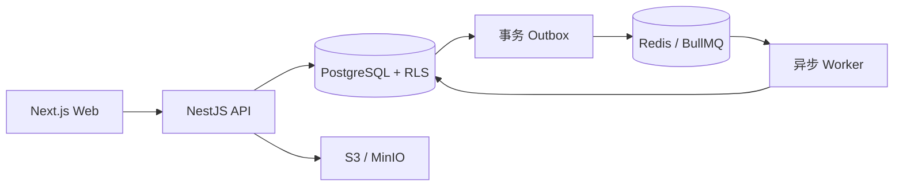

# 个性化英语学习平台

General + TOEFL 多租户英语学习平台 V1.1。仓库包含可运行的官方 Web、NestJS API、BullMQ Worker、PostgreSQL/RLS 数据层、Redis、S3 兼容对象存储以及完整的工程规格附件。

## 已实现的核心闭环

- 全局账号与机构成员身份分离，同一用户可在不同机构拥有不同角色。
- 学生、教师、班级、师生关系、考试目标和 General/TOEFL 学习路径。
- 内容、题目、任务和学习路径采用稳定实体 + 不可变发布版本。
- 教师按学生、班级或路径布置任务，Worker 物化学生任务并按槽位与来源优先级解析冲突。
- 学生开始 Attempt、带 ETag 自动保存、幂等提交、客观题自动评分、写作教师批改、退回后同一 Attempt 重交。
- PostgreSQL 强制 RLS、复合租户外键、RFC 7807 错误、Cookie 会话、CSRF、Refresh Token 轮换与复用检测。
- 事务 Outbox、BullMQ 重放保护、S3 预签名直传与服务端完整性确认。
- 结构化日志、Sentry 异常上报和 OpenTelemetry OTLP 链路追踪；未配置目标地址时 SDK 保持关闭。



## 本地启动

需要 Node.js 24+、pnpm 11+ 和 Docker Desktop。

```bash
pnpm install --frozen-lockfile
cp .env.example .env
pnpm infra:up
pnpm db:migrate
pnpm db:seed
pnpm dev
```

Windows PowerShell 复制环境文件：

```powershell
Copy-Item .env.example .env
```

也可以一条命令构建并启动带演示数据的完整容器栈：

```bash
pnpm stack:demo
```

启动后访问：

- Web：http://localhost:3000
- API readiness：http://localhost:4000/health/ready
- MinIO 控制台：http://localhost:9001

如果本机 `3000` 已被占用，可在启动 Compose 前同时设置 `WEB_PORT` 和 `WEB_ORIGIN`，例如 PowerShell：`$env:WEB_PORT='3100'; $env:WEB_ORIGIN='http://localhost:3100'`。

开发种子账号的密码均为 `Demo123!`：

| 角色       | 邮箱                   |
| ---------- | ---------------------- |
| 机构 Owner | `owner@example.test`   |
| 教师       | `teacher@example.test` |
| 学生       | `student@example.test` |

`.env.example` 仅供本地开发。部署前必须替换 JWT、数据库和对象存储凭据，并将 `COOKIE_SECURE` 设为 `true`。
API 连接池可通过 `DATABASE_POOL_MAX` 和 `DATABASE_STATEMENT_TIMEOUT_MS` 调整；设置 `SENTRY_DSN`、`OTEL_EXPORTER_OTLP_ENDPOINT` 后即可启用生产监控。

## 常用命令

```bash
pnpm typecheck       # 全仓类型检查
pnpm lint            # 架构边界与各包 lint
pnpm test            # 单元测试
pnpm build           # 生产构建
pnpm test:security   # 两租户数据库/RLS 安全验收
pnpm test:e2e        # 在已启动的干净服务上运行纵向闭环验收
pnpm test:performance # 1000 活跃虚拟用户、100 个在途请求与自动保存 P95 验收
pnpm db:migrate      # 执行增量迁移
pnpm db:seed         # 写入幂等开发数据
pnpm infra:down      # 停止本地基础设施
```

如需重新运行会改变 Attempt 状态的端到端测试，先重置开发数据和队列：

```powershell
docker exec english-platform-redis-1 redis-cli FLUSHDB
$env:ALLOW_DATABASE_RESET='true'
pnpm db:reset
```

随后启动 API 与 Worker，再执行 `pnpm test:e2e`。禁止在生产环境使用 `db:reset`；命令本身也会拒绝生产环境。

## 工程结构

| 路径                            | 职责                                            |
| ------------------------------- | ----------------------------------------------- |
| `apps/web`                      | Next.js 官方学生、教师和管理员 Web              |
| `apps/api`                      | NestJS 模块化单体与 HTTP 契约实现               |
| `apps/worker`                   | Outbox 投递、任务物化、自动评分和进度处理       |
| `packages/database`             | SQL migrations、RLS、数据库上下文和开发 seed    |
| `packages/shared`               | 跨端领域类型与确定性任务解析规则                |
| `packages/api-contract`         | 由 OpenAPI 生成的 TypeScript 契约               |
| `tests/e2e`                     | 真实 API/Worker/PostgreSQL/Redis/MinIO 纵向验收 |
| `outputs/english-platform-v1-1` | V1.1 工程规格与交付附件                         |

## 工程规格

- [开发者文档 V1.1](outputs/english-platform-v1-1/个性化英语学习平台开发者文档_V1.1.docx)
- [数据模型与 RLS](outputs/english-platform-v1-1/data-model.md)
- [OpenAPI 3.1](outputs/english-platform-v1-1/openapi-v1.yaml)
- [权限与租户测试矩阵](outputs/english-platform-v1-1/权限与租户测试矩阵.xlsx)
- [架构决策记录](outputs/english-platform-v1-1/ADR.md)
- [运行与恢复手册](docs/operations.md)
- [腾讯云生产部署手册](docs/tencent-cloud-deployment.md)
- [腾讯云轻量服务器低成本部署](docs/tencent-cloud-lighthouse-deployment.md)

OpenAPI 是接口唯一真相源。修改契约后运行 `pnpm contract:generate`，并提交生成的 `packages/api-contract/src/schema.d.ts`。

## 当前产品边界

V1.1 支持官方 Web、客观题和文本写作、基础 CMS、General + TOEFL、基础结果/反馈/进度。AI 评分与推荐、口语、原生 App、家长账号、开放 API、SSO、直播、课程市场和高级统计不在本版本范围内。
