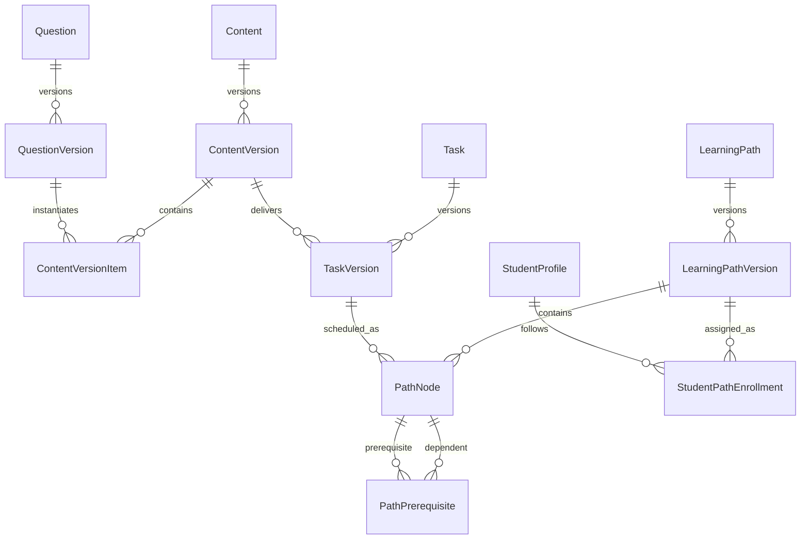
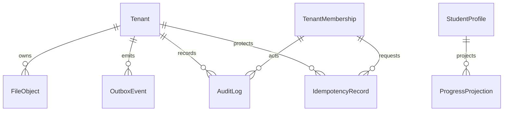

# 个性化英语学习平台 V1.1 数据模型规格

> 状态：Implementation Ready
> 数据库：PostgreSQL，共享数据库、共享租户 Schema
> 适用范围：General + TOEFL MVP
> 术语规则：正文使用逻辑实体名（PascalCase），物理表名使用 snake_case。

## 1. 设计基线

### 1.1 不可变约束

1. `User` 是全局账号；用户通过 `TenantMembership` 加入一个或多个 `Tenant`。业务角色只挂在成员关系上，`super_admin` 只作为平台角色存在。
2. 除 `tenants` 根表、全局身份表以及 `platform` 只读目录外，所有租户业务表都必须包含 `tenant_id uuid NOT NULL`。
3. 任意两个租户业务表之间的引用都使用 `(tenant_id, id)` 复合外键；禁止只按 `id` 建立跨表业务引用。
4. `Content`、`Question`、`LearningPath`、`Task` 采用“稳定实体 + 发布版本”。已发布版本及其子记录只读，不能 UPDATE 或 DELETE。
5. `TaskAssignment` 只保存分配意图；`StudentTaskItem` 是学生实际可见任务的物化结果；来源、覆盖、尝试、提交、评分和反馈均保留历史。
6. 所有业务时间使用 `timestamptz` 并以 UTC 写入；机构时区只用于展示和排程换算。
7. 所有 ID 使用 UUIDv7，数据库类型为 `uuid`；由应用统一生成，API wire format 仍为标准 UUID 字符串。
8. JSONB 只承载结构化内容、规则或快照，不承载本应具有外键的实体引用。每个 JSONB 字段必须在应用层通过版本化 JSON Schema 校验。

### 1.2 通用列与类型

除纯连接表另有说明外，租户业务表具有下列通用列：

| 字段 | 类型 | 可空 | 约束 | 说明 |
|---|---|---:|---|---|
| `id` | uuid | 否 | PK；UUIDv7 | 稳定主键 |
| `tenant_id` | uuid | 否 | FK → `tenants.id`；UNIQUE (`tenant_id`, `id`) 的一部分 | RLS 和复合外键租户键 |
| `created_at` | timestamptz | 否 | DEFAULT `now()` | UTC 创建时间 |
| `updated_at` | timestamptz | 否 | DEFAULT `now()` | 仅可变表维护；不可变表不设置或保持等于创建时间 |

统一约定：

- 文本代码字段使用小写 snake_case，长度上限在 API 和数据库同时校验。
- 金额以最小货币单位整数存储；本模型的分数使用 `numeric(8,2)`。
- 内容哈希、请求哈希和快照哈希均为规范化 JSON/文本的 SHA-256 小写十六进制，类型 `char(64)`。
- 软停用使用显式状态和时间，不使用通用 `deleted_at`。涉及历史提交的数据不物理删除。
- 列表游标固定为 `(created_at, id)` 或各查询明确给出的排序列加 `id`，保证稳定翻页。

## 2. Mermaid ERD

### 2.1 身份、机构与教学关系

```mermaid
erDiagram
    Tenant ||--o{ TenantMembership : contains
    User ||--o{ TenantMembership : joins
    Tenant ||--o{ MembershipRole : defines
    TenantMembership ||--o{ MembershipRoleAssignment : receives
    MembershipRole ||--o{ MembershipRoleAssignment : grants
    TenantMembership ||--o| StudentProfile : has
    TenantMembership ||--o| TeacherProfile : has
    StudentProfile ||--o{ StudentTeacherLink : student
    TeacherProfile ||--o{ StudentTeacherLink : teacher
    Class ||--o{ ClassTeacher : staffed_by
    TeacherProfile ||--o{ ClassTeacher : teaches
    Class ||--o{ ClassStudent : enrolls
    StudentProfile ||--o{ ClassStudent : attends
    Exam ||--o{ StudentExamGoal : targets
    StudentProfile ||--o{ StudentExamGoal : sets
    User ||--o{ AuthSession : authenticates
```

### 2.2 内容、路径与任务定义



### 2.3 分配、作答与评分

```mermaid
erDiagram
    TaskVersion ||--o{ TaskAssignment : assigned
    TaskAssignment ||--o{ TaskAssignmentStudentTarget : targets
    StudentProfile ||--o{ TaskAssignmentStudentTarget : receives
    TaskAssignment ||--o{ TaskAssignmentClassTarget : targets
    Class ||--o{ TaskAssignmentClassTarget : receives
    TaskAssignment ||--o{ TaskAssignmentPathTarget : targets
    PathNode ||--o{ TaskAssignmentPathTarget : receives
    StudentProfile ||--o{ StudentTaskItem : owns
    TaskVersion ||--o{ StudentTaskItem : materializes
    StudentTaskItem ||--o{ StudentTaskSource : derives_from
    TaskAssignment ||--o{ StudentTaskSource : contributes
    StudentTaskItem ||--o{ StudentTaskOverride : overridden_by
    StudentTaskItem ||--o{ TaskAttempt : attempted_as
    TaskAttempt ||--o{ AttemptItemSnapshot : freezes
    TaskAttempt ||--o| AttemptDraft : autosaves
    TaskAttempt ||--o{ SubmissionSnapshot : submits
    TaskAttempt ||--o{ ScoreDecision : scored_by
    TaskAttempt ||--o{ Feedback : receives
```

### 2.4 文件、事件与审计



## 3. 数据字典

### 3.1 全局身份与租户

#### Tenant — `tenants`

`tenants` 是租户根表，因此不含 `tenant_id`。

| 字段 | 类型 | 可空 | 约束 | 说明 |
|---|---|---:|---|---|
| `id` | uuid | 否 | PK | Tenant ID |
| `code` | varchar(50) | 否 | UNIQUE；`^[a-z0-9][a-z0-9_-]{1,49}$` | API 和存储前缀代码 |
| `name` | varchar(200) | 否 |  | 机构名称 |
| `status` | tenant_status | 否 | DEFAULT `active` | `active / suspended / closed` |
| `timezone` | varchar(64) | 否 | DEFAULT `Asia/Shanghai` | 有效 IANA 时区 |
| `locale` | varchar(16) | 否 | DEFAULT `zh-CN` | 默认界面区域 |
| `settings` | jsonb | 否 | DEFAULT `{}`；Schema `tenant-settings/v1` | 仅存租户级可配置项 |
| `created_at`, `updated_at` | timestamptz | 否 |  | UTC |

关闭租户只改变 `status`；正式数据删除必须走单独的合规清理流程。

#### User — `users`

`users` 是全局身份表，不受租户 RLS；只允许 Identity 模块访问。

| 字段 | 类型 | 可空 | 约束 | 说明 |
|---|---|---:|---|---|
| `id` | uuid | 否 | PK | 全局 User ID |
| `email_normalized` | citext | 是 | 部分 UNIQUE | 规范化邮箱 |
| `phone_e164` | varchar(20) | 是 | 部分 UNIQUE | E.164 手机号 |
| `password_hash` | text | 否 | Argon2id | 不记录明文或可逆密码 |
| `display_name` | varchar(100) | 否 |  | 显示名 |
| `status` | user_status | 否 | DEFAULT `active` | `active / locked / disabled` |
| `platform_role` | platform_role | 否 | DEFAULT `none` | `none / super_admin` |
| `last_login_at` | timestamptz | 是 |  | 最近成功登录 |
| `created_at`, `updated_at` | timestamptz | 否 |  | UTC |

CHECK：`email_normalized IS NOT NULL OR phone_e164 IS NOT NULL`。修改 `platform_role` 必须通过平台管理命令并写入租户外的平台安全审计。

#### TenantMembership — `tenant_memberships`

| 字段 | 类型 | 可空 | 约束 | 说明 |
|---|---|---:|---|---|
| `id`, `tenant_id` | uuid | 否 | PK；租户复合唯一 | 成员关系 |
| `user_id` | uuid | 否 | FK → `users.id` | 全局账号 |
| `status` | membership_status | 否 |  | `invited / active / suspended / left` |
| `invited_by_membership_id` | uuid | 是 | 复合 FK → `tenant_memberships` | 邀请人 |
| `joined_at` | timestamptz | 是 |  | 激活时间 |
| `suspended_at`, `left_at` | timestamptz | 是 |  | 状态时间 |
| `created_at`, `updated_at` | timestamptz | 否 |  |  |

UNIQUE (`tenant_id`, `user_id`)。离开后重新加入复用原成员记录并恢复状态，避免同一用户在一个租户产生多个主体。

#### MembershipRole — `membership_roles`

| 字段 | 类型 | 可空 | 约束 | 说明 |
|---|---|---:|---|---|
| `id`, `tenant_id` | uuid | 否 | PK；租户复合唯一 | 角色定义 |
| `code` | varchar(40) | 否 | UNIQUE (`tenant_id`, `code`) | 内置：`owner / admin / teacher / student / content_editor / analyst` |
| `name` | varchar(80) | 否 |  | 角色显示名 |
| `permissions` | jsonb | 否 | Schema `permission-set/v1` | 权限代码数组；不写资源 ID |
| `is_system` | boolean | 否 | DEFAULT false | 内置角色不可删除 |
| `created_at`, `updated_at` | timestamptz | 否 |  |  |

#### `membership_role_assignments`（支持表）

| 字段 | 类型 | 可空 | 约束 | 说明 |
|---|---|---:|---|---|
| `id`, `tenant_id` | uuid | 否 | PK；租户复合唯一 | 角色授予 |
| `membership_id` | uuid | 否 | 复合 FK → `tenant_memberships` | 成员 |
| `role_id` | uuid | 否 | 复合 FK → `membership_roles` | 角色 |
| `granted_by_membership_id` | uuid | 是 | 复合 FK → `tenant_memberships` | 系统初始化时可空 |
| `created_at` | timestamptz | 否 |  |  |

UNIQUE (`tenant_id`, `membership_id`, `role_id`)。至少保留一个 active `owner`，撤销最后一个 owner 必须返回冲突。

#### AuthSession — `auth_sessions`

该表属于全局 Identity 域，不是租户业务表，因此 `active_tenant_id` 可空。

| 字段 | 类型 | 可空 | 约束 | 说明 |
|---|---|---:|---|---|
| `id` | uuid | 否 | PK | Session ID |
| `user_id` | uuid | 否 | FK → `users.id` | 登录账号 |
| `family_id` | uuid | 否 | INDEX | Refresh Token 轮换族 |
| `refresh_token_hash` | char(64) | 否 | UNIQUE | 仅保存哈希 |
| `active_tenant_id` | uuid | 是 | FK → `tenants.id` | 当前租户上下文 |
| `active_membership_id` | uuid | 是 | 逻辑上必须属于 active tenant | 当前成员上下文 |
| `expires_at` | timestamptz | 否 |  | 绝对到期 |
| `rotated_at`, `revoked_at`, `reuse_detected_at` | timestamptz | 是 |  | 轮换、撤销、复用检测 |
| `ip_hash`, `user_agent_hash` | char(64) | 是 |  | 最小化设备审计信息 |
| `created_at` | timestamptz | 否 |  |  |

`(active_tenant_id, active_membership_id)` 使用复合外键引用 `tenant_memberships(tenant_id, id)`；两列必须同时为空或同时非空。

同一 `family_id` 检测到旧 Token 复用时，原子撤销整个 token family。

### 3.2 学生、教师、班级与考试目标

#### StudentProfile — `student_profiles`

| 字段 | 类型 | 可空 | 约束 | 说明 |
|---|---|---:|---|---|
| `id`, `tenant_id` | uuid | 否 | PK；租户复合唯一 | Student ID |
| `membership_id` | uuid | 否 | 复合 FK；UNIQUE (`tenant_id`, `membership_id`) | 必须具有 student 角色 |
| `student_no` | varchar(64) | 是 | 部分 UNIQUE (`tenant_id`, `student_no`) | 机构学号 |
| `grade_level` | varchar(32) | 是 |  | 年级，自由代码但受长度限制 |
| `date_of_birth` | date | 是 | 加密列或受控 PII 存储 | 未成年人判定 |
| `status` | profile_status | 否 | `active / inactive` |  |
| `created_at`, `updated_at` | timestamptz | 否 |  |  |

#### TeacherProfile — `teacher_profiles`

| 字段 | 类型 | 可空 | 约束 | 说明 |
|---|---|---:|---|---|
| `id`, `tenant_id` | uuid | 否 | PK；租户复合唯一 | Teacher ID |
| `membership_id` | uuid | 否 | 复合 FK；UNIQUE (`tenant_id`, `membership_id`) | 必须具有 teacher 角色 |
| `employee_no` | varchar(64) | 是 | 部分 UNIQUE (`tenant_id`, `employee_no`) | 工号 |
| `specialties` | text[] | 否 | DEFAULT `{}` | 受控代码列表 |
| `status` | profile_status | 否 | `active / inactive` |  |
| `created_at`, `updated_at` | timestamptz | 否 |  |  |

#### StudentTeacherLink — `student_teacher_links`

| 字段 | 类型 | 可空 | 约束 | 说明 |
|---|---|---:|---|---|
| `id`, `tenant_id` | uuid | 否 | PK；租户复合唯一 | 师生关系 |
| `student_profile_id` | uuid | 否 | 复合 FK → `student_profiles` | 学生 |
| `teacher_profile_id` | uuid | 否 | 复合 FK → `teacher_profiles` | 教师 |
| `relationship_type` | teacher_link_type | 否 | `primary / advisor / subject` | 关系类型 |
| `subject_code` | varchar(40) | 是 |  | `subject` 时必填 |
| `valid_from` | timestamptz | 否 |  | 生效时间 |
| `valid_to` | timestamptz | 是 | CHECK 大于 `valid_from` | 结束时间 |
| `created_at` | timestamptz | 否 |  |  |

同一学生在任一时刻最多一个 `primary` 教师；使用 `tstzrange(valid_from, coalesce(valid_to, 'infinity'))` 排斥约束实现。

#### Class — `classes`

| 字段 | 类型 | 可空 | 约束 | 说明 |
|---|---|---:|---|---|
| `id`, `tenant_id` | uuid | 否 | PK；租户复合唯一 | Class ID |
| `code` | varchar(50) | 否 | UNIQUE (`tenant_id`, `code`) | 班级代码 |
| `name` | varchar(120) | 否 |  | 名称 |
| `status` | class_status | 否 | `draft / active / archived` |  |
| `starts_on`, `ends_on` | date | 是 | CHECK 结束不早于开始 | 教学周期 |
| `created_by_membership_id` | uuid | 否 | 复合 FK → `tenant_memberships` | 创建者 |
| `created_at`, `updated_at` | timestamptz | 否 |  |  |

#### ClassTeacher — `class_teachers`

| 字段 | 类型 | 可空 | 约束 | 说明 |
|---|---|---:|---|---|
| `id`, `tenant_id` | uuid | 否 | PK；租户复合唯一 | 任教关系 |
| `class_id` | uuid | 否 | 复合 FK → `classes` | 班级 |
| `teacher_profile_id` | uuid | 否 | 复合 FK → `teacher_profiles` | 教师 |
| `role` | class_teacher_role | 否 | `lead / assistant / grader` | 班级角色 |
| `joined_at` | timestamptz | 否 |  |  |
| `left_at` | timestamptz | 是 | CHECK 大于 `joined_at` | 退班保留历史 |
| `created_at` | timestamptz | 否 |  |  |

活动关系部分唯一：UNIQUE (`tenant_id`, `class_id`, `teacher_profile_id`) WHERE `left_at IS NULL`。

#### ClassStudent — `class_students`

| 字段 | 类型 | 可空 | 约束 | 说明 |
|---|---|---:|---|---|
| `id`, `tenant_id` | uuid | 否 | PK；租户复合唯一 | 入班关系 |
| `class_id` | uuid | 否 | 复合 FK → `classes` | 班级 |
| `student_profile_id` | uuid | 否 | 复合 FK → `student_profiles` | 学生 |
| `joined_at` | timestamptz | 否 |  | 入班时间 |
| `left_at` | timestamptz | 是 | CHECK 大于 `joined_at` | 退班时间 |
| `created_at` | timestamptz | 否 |  |  |

活动关系部分唯一：UNIQUE (`tenant_id`, `class_id`, `student_profile_id`) WHERE `left_at IS NULL`。退班只设置 `left_at`，不删除已物化的任务、尝试或提交。

#### Exam — `platform.exams`

`Exam` 属于平台只读目录，不含 `tenant_id`。

| 字段 | 类型 | 可空 | 约束 | 说明 |
|---|---|---:|---|---|
| `id` | uuid | 否 | PK | Exam ID |
| `code` | varchar(40) | 否 | UNIQUE | MVP 启用 `toefl` |
| `name` | varchar(100) | 否 |  | 显示名 |
| `score_schema` | jsonb | 否 | Schema `exam-score/v1` | 总分与分项规则 |
| `status` | platform_publication_status | 否 | `draft / published / retired` | 租户只读 published 视图 |
| `published_at` | timestamptz | 是 |  |  |

#### StudentExamGoal — `student_exam_goals`

| 字段 | 类型 | 可空 | 约束 | 说明 |
|---|---|---:|---|---|
| `id`, `tenant_id` | uuid | 否 | PK；租户复合唯一 | 多考试目标 |
| `student_profile_id` | uuid | 否 | 复合 FK → `student_profiles` | 学生 |
| `exam_id` | uuid | 否 | FK → `platform.exams.id` | 平台考试 |
| `target_score` | numeric(8,2) | 是 | 必须落在 Exam score schema 范围 | 目标总分 |
| `target_components` | jsonb | 否 | DEFAULT `{}`；Schema `exam-goal-components/v1` | 分项目标 |
| `target_date` | date | 是 |  | 计划考试日 |
| `is_primary` | boolean | 否 | DEFAULT false | 当前首要目标 |
| `status` | goal_status | 否 | `active / achieved / cancelled` |  |
| `created_at`, `updated_at` | timestamptz | 否 |  |  |

每名学生只允许一个 active primary goal（部分唯一索引）；同一考试可以保留多个历史目标，但最多一个 active 目标。

### 3.3 内容与题目

#### Content — `contents`

| 字段 | 类型 | 可空 | 约束 | 说明 |
|---|---|---:|---|---|
| `id`, `tenant_id` | uuid | 否 | PK；租户复合唯一 | 稳定 Content |
| `kind` | content_kind | 否 | `lesson / passage / question_set / writing_prompt` | 内容类别 |
| `slug` | varchar(120) | 否 | UNIQUE (`tenant_id`, `slug`) | 租户内稳定代码 |
| `status` | catalog_entity_status | 否 | `active / archived` | 稳定实体状态 |
| `current_published_version_id` | uuid | 是 | 复合 FK → `content_versions` | 当前发布指针 |
| `created_by_membership_id` | uuid | 否 | 复合 FK | 创建者 |
| `created_at`, `updated_at` | timestamptz | 否 |  |  |

#### ContentVersion — `content_versions`

| 字段 | 类型 | 可空 | 约束 | 说明 |
|---|---|---:|---|---|
| `id`, `tenant_id` | uuid | 否 | PK；租户复合唯一 | 版本 ID |
| `content_id` | uuid | 否 | 复合 FK → `contents` | 稳定实体 |
| `version_no` | integer | 否 | > 0；UNIQUE (`tenant_id`, `content_id`, `version_no`) | 单调版本号 |
| `publication_state` | publication_state | 否 | `draft / published` | 发布后冻结 |
| `title` | varchar(240) | 否 |  | 标题 |
| `locale` | varchar(16) | 否 | DEFAULT `en` | 内容语言 |
| `body` | jsonb | 否 | Schema `content-body/v1` | 结构化正文 |
| `metadata` | jsonb | 否 | Schema `content-metadata/v1` | CEFR、技能、标签等 |
| `content_hash` | char(64) | 是 | published 时 NOT NULL | 规范化内容哈希 |
| `source_platform_content_version_id` | uuid | 是 | FK → `platform.content_versions.id` | 官方版本克隆来源 |
| `published_at` | timestamptz | 是 | published 时 NOT NULL |  |
| `published_by_membership_id` | uuid | 是 | 复合 FK | 发布者 |
| `created_at`, `updated_at` | timestamptz | 否 |  | draft 可变 |

#### Question — `questions`

| 字段 | 类型 | 可空 | 约束 | 说明 |
|---|---|---:|---|---|
| `id`, `tenant_id` | uuid | 否 | PK；租户复合唯一 | 稳定 Question |
| `kind` | question_kind | 否 | 见下 | 题型 |
| `slug` | varchar(120) | 否 | UNIQUE (`tenant_id`, `slug`) | 租户内稳定代码 |
| `status` | catalog_entity_status | 否 | `active / archived` | 稳定实体状态 |
| `current_published_version_id` | uuid | 是 | 复合 FK → `question_versions` | 当前发布指针 |
| `created_by_membership_id` | uuid | 否 | 复合 FK | 创建者 |
| `created_at`, `updated_at` | timestamptz | 否 |  |  |

`question_kind` 固定为 `single_choice / multiple_choice / true_false / short_text / essay`。

#### QuestionVersion — `question_versions`

| 字段 | 类型 | 可空 | 约束 | 说明 |
|---|---|---:|---|---|
| `id`, `tenant_id` | uuid | 否 | PK；租户复合唯一 | 题目版本 |
| `question_id` | uuid | 否 | 复合 FK → `questions` | 稳定题目 |
| `version_no` | integer | 否 | > 0；同题唯一 |  |
| `publication_state` | publication_state | 否 | `draft / published` |  |
| `prompt` | jsonb | 否 | Schema `question-prompt/v1` | 题干 |
| `options` | jsonb | 是 | 客观选择题必填 | 每个选项含稳定 `option_id` |
| `answer_key` | jsonb | 是 | essay 可空 | 仅服务端读取 |
| `scoring_rule` | jsonb | 否 | Schema `scoring-rule/v1` | 自动或人工评分规则 |
| `max_score` | numeric(8,2) | 否 | > 0 | 满分 |
| `content_hash` | char(64) | 是 | published 时 NOT NULL |  |
| `source_platform_question_version_id` | uuid | 是 | FK → `platform.question_versions.id` | 官方来源 |
| `published_at`, `published_by_membership_id` | timestamptz / uuid | 是 | published 时必填 |  |
| `created_at`, `updated_at` | timestamptz | 否 |  |  |

#### ContentVersionItem — `content_version_items`

| 字段 | 类型 | 可空 | 约束 | 说明 |
|---|---|---:|---|---|
| `id`, `tenant_id` | uuid | 否 | PK；租户复合唯一 | 内容中的题目项 |
| `content_version_id` | uuid | 否 | 复合 FK → `content_versions` | 所属内容版本 |
| `question_version_id` | uuid | 否 | 复合 FK → `question_versions` | 固定题目版本 |
| `section_key` | varchar(80) | 是 |  | 章节 |
| `position` | integer | 否 | >= 0；同内容版本唯一 | 排序 |
| `points` | numeric(8,2) | 否 | > 0 | 本次使用分值 |
| `settings` | jsonb | 否 | Schema `content-item-settings/v1` | 是否随机、提示等 |
| `created_at` | timestamptz | 否 |  | 随发布版本冻结 |

UNIQUE (`tenant_id`, `content_version_id`, `question_version_id`)；如需重复使用同一题目，必须创建不同 Content 或显式的新 QuestionVersion。

文件关联使用三个带真实复合外键的支持表：`content_version_files`、`question_version_files`、`feedback_files`。每表包含 `tenant_id`、对应资源 ID、`file_object_id`、`usage` 和 `position`，不得使用多态 `resource_type + resource_id`。

### 3.4 学习路径

#### LearningPath — `learning_paths`

| 字段 | 类型 | 可空 | 约束 | 说明 |
|---|---|---:|---|---|
| `id`, `tenant_id` | uuid | 否 | PK；租户复合唯一 | 稳定 Path |
| `slug` | varchar(120) | 否 | UNIQUE (`tenant_id`, `slug`) | 稳定代码 |
| `category` | path_category | 否 | `general / exam` | 路径类别 |
| `exam_id` | uuid | 是 | FK → `platform.exams.id` | category=exam 时必填 |
| `status` | catalog_entity_status | 否 | `active / archived` |  |
| `current_published_version_id` | uuid | 是 | 复合 FK → `learning_path_versions` | 当前发布版本 |
| `created_by_membership_id` | uuid | 否 | 复合 FK |  |
| `created_at`, `updated_at` | timestamptz | 否 |  |  |

#### LearningPathVersion — `learning_path_versions`

| 字段 | 类型 | 可空 | 约束 | 说明 |
|---|---|---:|---|---|
| `id`, `tenant_id` | uuid | 否 | PK；租户复合唯一 | Path version |
| `learning_path_id` | uuid | 否 | 复合 FK → `learning_paths` |  |
| `version_no` | integer | 否 | > 0；同 Path 唯一 |  |
| `publication_state` | publication_state | 否 |  |  |
| `title`, `description` | varchar(240) / text | 否 / 是 |  |  |
| `completion_rule` | jsonb | 否 | Schema `path-completion/v1` | 路径完成规则 |
| `content_hash` | char(64) | 是 | published 时必填 | 包含节点和依赖的哈希 |
| `source_platform_learning_path_version_id` | uuid | 是 | FK → `platform.learning_path_versions.id` | 官方来源 |
| `published_at`, `published_by_membership_id` | timestamptz / uuid | 是 | published 时必填 |  |
| `created_at`, `updated_at` | timestamptz | 否 |  |  |

#### PathNode — `path_nodes`

| 字段 | 类型 | 可空 | 约束 | 说明 |
|---|---|---:|---|---|
| `id`, `tenant_id` | uuid | 否 | PK；租户复合唯一 | 节点 |
| `learning_path_version_id` | uuid | 否 | 复合 FK | 所属版本 |
| `node_key` | varchar(100) | 否 | 同 PathVersion 唯一 | 不随标题变化的语义键 |
| `task_version_id` | uuid | 否 | 复合 FK → `task_versions` | 固定任务版本 |
| `position` | integer | 否 | >= 0；同 PathVersion 唯一 | 默认顺序 |
| `slot_key_template` | varchar(160) | 否 |  | 物化时渲染成 `slot_key` |
| `available_offset_days` | integer | 否 | DEFAULT 0 | 相对 enrollment 时间 |
| `due_offset_days` | integer | 是 | >= available offset | 可空表示无截止 |
| `close_offset_days` | integer | 是 | >= due offset 或 available offset | 可空表示无关闭时间 |
| `is_required` | boolean | 否 | DEFAULT true | 完成规则输入 |
| `unlock_rule` | jsonb | 否 | Schema `path-unlock/v1` | 额外解锁条件 |
| `created_at` | timestamptz | 否 |  | 随发布版本冻结 |

#### PathPrerequisite — `path_prerequisites`

| 字段 | 类型 | 可空 | 约束 | 说明 |
|---|---|---:|---|---|
| `id`, `tenant_id` | uuid | 否 | PK；租户复合唯一 | 依赖边 |
| `learning_path_version_id` | uuid | 否 | 复合 FK | 冗余租户内归属，用于一致性约束 |
| `path_node_id` | uuid | 否 | 复合 FK → `path_nodes` | 被解锁节点 |
| `prerequisite_node_id` | uuid | 否 | 复合 FK → `path_nodes` | 前置节点 |
| `condition` | prerequisite_condition | 否 | `completed / min_score` |  |
| `threshold` | numeric(8,2) | 是 | min_score 时必填 | 分数阈值 |
| `created_at` | timestamptz | 否 |  |  |

UNIQUE (`tenant_id`, `path_node_id`, `prerequisite_node_id`)，CHECK 两节点不同。复合外键必须同时包含 `learning_path_version_id`，发布事务通过拓扑排序拒绝环。

#### StudentPathEnrollment — `student_path_enrollments`

| 字段 | 类型 | 可空 | 约束 | 说明 |
|---|---|---:|---|---|
| `id`, `tenant_id` | uuid | 否 | PK；租户复合唯一 | 学生路径实例 |
| `student_profile_id` | uuid | 否 | 复合 FK → `student_profiles` |  |
| `learning_path_version_id` | uuid | 否 | 复合 FK → 已发布版本 | 入组时固定版本 |
| `student_exam_goal_id` | uuid | 是 | 复合 FK → `student_exam_goals` | exam path 时可关联 |
| `source` | enrollment_source | 否 | `manual / general / exam_goal` |  |
| `status` | enrollment_status | 否 | `active / paused / completed / cancelled` |  |
| `enrolled_at` | timestamptz | 否 |  | 排程基准 |
| `paused_at`, `completed_at`, `cancelled_at` | timestamptz | 是 |  | 状态时间 |
| `assigned_by_membership_id` | uuid | 是 | 复合 FK | 系统自动可空 |
| `created_at`, `updated_at` | timestamptz | 否 |  |  |

同一学生同一 PathVersion 最多一个 active/paused enrollment。暂停只阻止尚未开始节点变为 available，不删除任务来源或提交。

### 3.5 任务定义与分配

#### Task — `tasks`

| 字段 | 类型 | 可空 | 约束 | 说明 |
|---|---|---:|---|---|
| `id`, `tenant_id` | uuid | 否 | PK；租户复合唯一 | 稳定 Task |
| `slug` | varchar(120) | 否 | UNIQUE (`tenant_id`, `slug`) | 租户内稳定代码 |
| `status` | catalog_entity_status | 否 | `active / archived` | 稳定实体状态 |
| `current_published_version_id` | uuid | 是 | 复合 FK → `task_versions` | 当前发布指针 |
| `created_by_membership_id` | uuid | 否 | 复合 FK | 创建者 |
| `created_at`, `updated_at` | timestamptz | 否 |  |  |

#### TaskVersion — `task_versions`

| 字段 | 类型 | 可空 | 约束 | 说明 |
|---|---|---:|---|---|
| `id`, `tenant_id` | uuid | 否 | PK；租户复合唯一 | Task version |
| `task_id` | uuid | 否 | 复合 FK → `tasks` |  |
| `version_no` | integer | 否 | > 0；同 Task 唯一 |  |
| `publication_state` | publication_state | 否 |  |  |
| `task_kind` | task_kind | 否 | `lesson / practice / assessment / writing` |  |
| `title` | varchar(240) | 否 |  |  |
| `instructions` | jsonb | 否 | Schema `task-instructions/v1` |  |
| `content_version_id` | uuid | 否 | 复合 FK → 已发布 `content_versions` | 固定内容 |
| `completion_rule` | jsonb | 否 | Schema `task-completion/v1` |  |
| `grading_policy` | jsonb | 否 | Schema `grading-policy/v1` | 自动/人工与通过线 |
| `estimated_minutes` | smallint | 是 | > 0 |  |
| `content_hash` | char(64) | 是 | published 时必填 | 含引用版本哈希 |
| `source_platform_task_version_id` | uuid | 是 | FK → `platform.task_versions.id` | 官方来源 |
| `published_at`, `published_by_membership_id` | timestamptz / uuid | 是 | published 时必填 |  |
| `created_at`, `updated_at` | timestamptz | 否 |  |  |

#### TaskAssignment — `task_assignments`

| 字段 | 类型 | 可空 | 约束 | 说明 |
|---|---|---:|---|---|
| `id`, `tenant_id` | uuid | 否 | PK；租户复合唯一 | 分配配置 |
| `task_version_id` | uuid | 否 | 复合 FK → 已发布 `task_versions` | 固定任务版本 |
| `source_type` | assignment_source | 否 | `admin_forced / individual / class / exam_path / general` | 决定权重 |
| `occurrence_key` | varchar(180) | 否 |  | 同一计划发生次的语义键 |
| `slot_key` | varchar(180) | 否 |  | 唯一冲突域；应包含周期/节点语义 |
| `explicit_priority` | smallint | 否 | 0..99，DEFAULT 0 | 同来源级别优先级 |
| `schedule_mode` | assignment_schedule_mode | 否 | `absolute / path_relative` | 排程方式 |
| `available_at` | timestamptz | 是 | absolute 时必填 | 可开始时间 |
| `due_at` | timestamptz | 是 | >= available | 截止时间 |
| `close_at` | timestamptz | 是 | >= due 或 available | 最晚提交 |
| `max_attempts` | smallint | 否 | 1..20，DEFAULT 1 | 仅限制学生主动 retry 产生的 attempt_no |
| `late_policy` | late_policy | 否 | `deny / allow / allow_with_penalty` |  |
| `status` | assignment_status | 否 | `draft / published / cancelled` |  |
| `published_at`, `cancelled_at` | timestamptz | 是 | 状态一致性 CHECK |  |
| `created_by_membership_id` | uuid | 否 | 复合 FK |  |
| `created_at`, `updated_at` | timestamptz | 否 |  |  |

`occurrence_key` 决定“是否是同一次任务”：解析唯一键为 `(student_profile_id, task_version_id, occurrence_key)`。复制同一个 occurrence_key 可让个人、班级或路径来源合并；要布置独立任务必须创建新的 occurrence_key。教师退回修改沿用当前 TaskAttempt；学生主动 retry 才增加 attempt_no。

`absolute` 适用于 student/class/admin 目标，直接使用 Assignment 时间；此时 occurrence_key 和 slot_key 是字面值。`path_relative` 只适用于 path target，按 `enrollment.enrolled_at + PathNode.*_offset_days` 为每名学生计算 Source 时间；此时 occurrence_key 必须包含 `{enrollment_id}` 占位符，slot_key 使用 PathNode 的 slot_key_template 并渲染同一 enrollment。PathNode 未提供 due/close offset 时相应时间为空。两种模式发布时使用互斥 CHECK，避免同时存在两套权威时间。

发布后冻结 task、来源类型、occurrence、slot、排程、尝试和目标；取消只能通过受控命令写 `cancelled_at`，并产生 AuditLog 和 OutboxEvent。

#### 三类目标表

| 表 | 必填复合外键 | 唯一约束 | 说明 |
|---|---|---|---|
| `task_assignment_student_targets` | `task_assignment_id`、`student_profile_id` | (`tenant_id`, assignment, student) | 个人或管理员直达 |
| `task_assignment_class_targets` | `task_assignment_id`、`class_id` | (`tenant_id`, assignment, class) | 对有效 ClassStudent 展开 |
| `task_assignment_path_targets` | `task_assignment_id`、`path_node_id`、`learning_path_version_id` | (`tenant_id`, assignment, path node) | 对有效/暂停 enrollment 展开；version 为复合外键的一部分 |

三表均具有 `id`、`tenant_id`、`created_at`。一条 Assignment 在发布时必须且只能使用一种目标表。`individual` 使用 student；`class` 使用 class；`general` 和 `exam_path` 使用 path；`admin_forced` 可使用任一类但仍只能选一种。Path target 的 `task_version_id` 必须等于 PathNode 固定的 TaskVersion；`general` 只能指向 category=general 的 Path，`exam_path` 只能指向 category=exam 的 Path。这些跨表不变量由发布事务中的约束触发器执行。

### 3.6 学生任务解析与覆盖

#### StudentTaskItem — `student_task_items`

| 字段 | 类型 | 可空 | 约束 | 说明 |
|---|---|---:|---|---|
| `id`, `tenant_id` | uuid | 否 | PK；租户复合唯一 | 学生任务实例 |
| `student_profile_id` | uuid | 否 | 复合 FK | 任务所有者 |
| `task_version_id` | uuid | 否 | 复合 FK → `task_versions` | 固定版本 |
| `occurrence_key` | varchar(180) | 否 | 与来源一致 | 发生次 |
| `slot_key` | varchar(180) | 否 | 当前胜出来源/覆盖后的槽位 | 冲突键 |
| `winning_source_id` | uuid | 是 | 复合 FK → `student_task_sources` | 无有效来源时可空 |
| `resolution_state` | resolution_state | 否 | `active / hidden / superseded` | 来源冲突结果 |
| `resolution_reason` | resolution_reason | 否 | 见说明 | `winner / override_hidden / source_inactive / slot_conflict / replaced` |
| `workflow_state` | workflow_state | 否 | 见状态机 | 作答状态 |
| `available_at` | timestamptz | 否 | 物化值 | 可被 reschedule 覆盖 |
| `due_at`, `close_at` | timestamptz | 是 | 时间顺序 CHECK |  |
| `resolution_revision` | bigint | 否 | >= 1 | 每次解析原子递增 |
| `resolved_at` | timestamptz | 否 |  |  |
| `created_at`, `updated_at` | timestamptz | 否 |  |  |

UNIQUE (`tenant_id`, `student_profile_id`, `task_version_id`, `occurrence_key`)。`workflow_state` 由命令服务事务维护，不由客户端直接写。

#### StudentTaskSource — `student_task_sources`

| 字段 | 类型 | 可空 | 约束 | 说明 |
|---|---|---:|---|---|
| `id`, `tenant_id` | uuid | 否 | PK；租户复合唯一 | 展开后的一个来源 |
| `student_task_item_id` | uuid | 否 | 复合 FK | 物化任务 |
| `student_profile_id` | uuid | 否 | 与 Item 组成复合 FK | 展开目标学生 |
| `task_assignment_id` | uuid | 否 | 复合 FK | 原始 Assignment |
| `student_target_id` | uuid | 是 | 复合 FK → student target | 三选一 |
| `class_target_id` | uuid | 是 | 复合 FK → class target | 三选一 |
| `path_target_id` | uuid | 是 | 复合 FK → path target | 三选一 |
| `class_id` | uuid | 是 | class 分支的复合 FK 键 | 保证 target 与 ClassStudent 属于同一班 |
| `learning_path_version_id` | uuid | 是 | path 分支的复合 FK 键 | 保证 target 与 Enrollment 属于同一路径版本 |
| `class_student_id` | uuid | 是 | 复合 FK → `class_students` | class 分支必填 |
| `student_path_enrollment_id` | uuid | 是 | 复合 FK → `student_path_enrollments` | path 分支必填 |
| `source_type` | assignment_source | 否 | Assignment 快照 |  |
| `source_weight` | smallint | 否 | 固定映射 | 500/400/300/200/100 |
| `explicit_priority` | smallint | 否 | Assignment 快照 |  |
| `published_at` | timestamptz | 否 | Assignment 快照 | 排序 |
| `occurrence_key` | varchar(180) | 否 | 字面值或渲染结果 | Item 去重键 |
| `slot_key`, `available_at` | varchar / timestamptz | 否 | Assignment 快照 |  |
| `due_at`, `close_at` | timestamptz | 是 |  |  |
| `inactive_at` | timestamptz | 是 |  | 退班、退路径或取消后停用 |
| `inactive_reason` | source_inactive_reason | 是 |  | `left_target / enrollment_paused / assignment_cancelled` 等 |
| `created_at` | timestamptz | 否 |  | 历史不删除 |

CHECK 三个 target ID 恰好一个非空：student 分支不得有关系行；class 分支必须同时有 `class_target_id + class_id + class_student_id`；path 分支必须同时有 `path_target_id + learning_path_version_id + student_path_enrollment_id`。复合外键同时验证目标、关系行、`student_profile_id` 和 Item 所有人，防止同租户内串错班级/路径/学生。分别建立三个部分唯一索引，按 Item + target + 关系行保证同一展开来源只产生一个 Source，并保留退班后再次入班或重新加入路径的独立来源历史。

#### StudentTaskOverride — `student_task_overrides`

| 字段 | 类型 | 可空 | 约束 | 说明 |
|---|---|---:|---|---|
| `id`, `tenant_id` | uuid | 否 | PK；租户复合唯一 | 追加式命令 |
| `student_task_item_id` | uuid | 否 | 复合 FK | 被覆盖项 |
| `action` | override_action | 否 | `hide / restore / replace / reschedule / require_redo` |  |
| `replacement_task_version_id` | uuid | 是 | replace 时必填，复合 FK | 替代版本 |
| `available_at`, `due_at`, `close_at` | timestamptz | 是 | reschedule 至少一项 | 新时间 |
| `reverses_override_id` | uuid | 是 | restore 时必填，复合 FK | 只能反转尚未被反转的 hide/replace |
| `reason` | varchar(500) | 否 |  | 审计原因 |
| `metadata` | jsonb | 否 | Schema `task-override/v1` | 非引用型扩展 |
| `created_by_membership_id` | uuid | 否 | 复合 FK | 操作者 |
| `created_at` | timestamptz | 否 |  | 决胜排序含 ID |

该表禁止 UPDATE/DELETE。replace 会以 `replacement:{override_id}` 作为 occurrence_key 创建替代 StudentTaskItem，并将原项标为 superseded；restore 反转 replace 时恢复原项并隐藏替代项。require_redo 仅在最新 Attempt 已 completed、没有 open Attempt 且 `attempt_no < max_attempts` 时允许；它只把 Item 标记为 returned/待 retry，不直接创建 TaskAttempt。只有学生显式执行 retry 命令才创建下一 attempt_no。教师不得 hide/replace admin_forced 来源胜出的任务；仅 tenant owner/admin 或 super_admin 可操作。

#### 任务解析算法

解析器以单个 Student 为原子边界，使用该学生行锁或等价 advisory transaction lock，按以下固定顺序执行：

1. 展开 published Assignment 的三类目标，保存具体 ClassStudent 或 StudentPathEnrollment，渲染 occurrence/slot/排程并创建或重新激活 StudentTaskSource；退班、取消和路径状态变化只设置 `inactive_at`。
2. 按 `(student, task_version, rendered occurrence_key)` upsert StudentTaskItem，同一任务的多个来源汇入同一 Item。
3. 对每个 Item 从 active Source 选胜出来源，排序元组按降序为 `(source_weight, explicit_priority, published_at, id)`。固定权重：`admin_forced=500`、`individual=400`、`class=300`、`exam_path=200`、`general=100`。
4. 按 `(created_at, id)` 重放追加式 Override，得到隐藏、替换和重排期结果。
5. 先将受影响槽位的候选项全部置为 superseded，再对非 hidden 的 Item 按最终 `slot_key` 分组；每组仍按胜出 Source 元组降序，第一项置为 `active/winner`，其余保持 `superseded/slot_conflict`。因此只有完全相同的 slot_key 才冲突，且部分唯一索引不会在切换 winner 时短暂冲突。
6. 原子写回 winner、排程、resolution state/reason、revision 和 resolved_at，并写 OutboxEvent。重复消费同一触发事件必须得到相同结果。

暂停 PathEnrollment 时：未开始且仅有该路径来源的任务变为 `hidden/source_inactive`，availability 为 locked；已有 Attempt 和所有 Submission 保留。退班同理。恢复后原 Source 重新激活，不生成重复 Item。

### 3.7 尝试、提交、评分与反馈

#### TaskAttempt — `task_attempts`

| 字段 | 类型 | 可空 | 约束 | 说明 |
|---|---|---:|---|---|
| `id`, `tenant_id` | uuid | 否 | PK；租户复合唯一 | 一次作答 |
| `student_task_item_id` | uuid | 否 | 复合 FK |  |
| `attempt_no` | smallint | 否 | >= 1；同 Item 唯一且连续 | 学生主动尝试序号；教师 return 不增加 |
| `state` | attempt_state | 否 | `in_progress / submitted / grading / returned / completed / cancelled` | Attempt 状态 |
| `snapshot_hash` | char(64) | 否 | 创建时计算 | 题目、顺序和评分规则总哈希 |
| `started_at` | timestamptz | 否 |  |  |
| `last_submitted_at`, `completed_at`, `returned_at` | timestamptz | 是 | 状态一致性 CHECK | 最近一次状态时间 |
| `created_at`, `updated_at` | timestamptz | 否 |  |  |

UNIQUE (`tenant_id`, `student_task_item_id`, `attempt_no`)。同一 Item 最多一个 open Attempt（`in_progress/submitted/grading/returned`）的部分唯一约束。start/retry 创建时初始状态均为 in_progress；returned 仍是 open 状态，学生恢复修改时在同一记录上转回 in_progress，不增加 attempt_no。

#### AttemptItemSnapshot — `attempt_item_snapshots`

| 字段 | 类型 | 可空 | 约束 | 说明 |
|---|---|---:|---|---|
| `id`, `tenant_id` | uuid | 否 | PK；租户复合唯一 | 冻结题目 |
| `task_attempt_id` | uuid | 否 | 复合 FK |  |
| `position` | integer | 否 | 同 Attempt 唯一 | 固定题序 |
| `content_version_item_id` | uuid | 否 | 复合 FK | 来源项 |
| `question_version_id` | uuid | 否 | 复合 FK | 来源版本 |
| `prompt_snapshot` | jsonb | 否 |  | 提交展示依据 |
| `options_snapshot` | jsonb | 是 |  | 选项内容 |
| `option_order` | jsonb | 是 |  | 稳定 option_id 数组 |
| `answer_key_snapshot` | jsonb | 是 | 仅评分服务可读 | 答案快照 |
| `scoring_rule_snapshot` | jsonb | 否 |  | 评分规则 |
| `max_score` | numeric(8,2) | 否 | > 0 |  |
| `snapshot_hash` | char(64) | 否 |  | 单项哈希 |
| `created_at` | timestamptz | 否 |  | 永久只读 |

#### AttemptDraft — `attempt_drafts`

| 字段 | 类型 | 可空 | 约束 | 说明 |
|---|---|---:|---|---|
| `id`, `tenant_id` | uuid | 否 | PK；租户复合唯一 | 当前草稿 |
| `task_attempt_id` | uuid | 否 | 复合 FK；UNIQUE | 每次 Attempt 一行 |
| `revision` | bigint | 否 | >= 1 | 乐观并发版本 |
| `etag` | char(64) | 否 | UNIQUE (`tenant_id`, attempt, etag) | 基于 attempt/revision/body hash |
| `responses` | jsonb | 否 | Schema `attempt-responses/v1` | 按 snapshot item ID 键控 |
| `saved_at` | timestamptz | 否 |  |  |
| `updated_at` | timestamptz | 否 |  |  |

保存必须携带 `If-Match`。SQL 更新条件同时匹配 attempt 和 revision，成功后 revision + 1 并返回新 ETag；旧 revision 返回 `412 Precondition Failed`，不得覆盖较新草稿。

教师 return 后保留同一 AttemptDraft，并以最近一次 SubmissionSnapshot 的 responses 作为继续编辑基线；revision 继续单调递增，不回退或另建 Draft 行。

#### SubmissionSnapshot — `submission_snapshots`

| 字段 | 类型 | 可空 | 约束 | 说明 |
|---|---|---:|---|---|
| `id`, `tenant_id` | uuid | 否 | PK；租户复合唯一 | 不可变提交 |
| `task_attempt_id` | uuid | 否 | 复合 FK | 同一 Attempt 可因 return 多次提交 |
| `submission_revision` | integer | 否 | >= 1；同 Attempt 连续唯一 | 首次为 1，每次重新提交 +1 |
| `previous_submission_snapshot_id` | uuid | 是 | 复合 FK；必须同 Attempt | revision=1 时为空，其余指向前一 revision |
| `draft_revision` | bigint | 否 |  | 被提交草稿 revision |
| `responses` | jsonb | 否 |  | 完整答案快照 |
| `submitted_at` | timestamptz | 否 | 服务端时间 | 权威时间 |
| `client_submitted_at` | timestamptz | 是 | 不参与逾期判定 | 诊断用途 |
| `is_late` | boolean | 否 | 服务端计算 | `submitted_at > due_at` |
| `snapshot_hash` | char(64) | 否 |  | 防篡改 |
| `created_at` | timestamptz | 否 |  | 永久只读 |

UNIQUE (`tenant_id`, `task_attempt_id`, `submission_revision`)，并对 `(tenant_id, task_attempt_id, draft_revision)` 建唯一约束，防止同一 Draft 被提交两次。提交事务锁定 Attempt，验证 ETag、close/late policy 和完整性，以 `max(submission_revision)+1` 插入新 Snapshot，改变状态并写 Outbox；相同幂等键重放返回同一 Snapshot。教师 return 后的重新提交仍使用原 attempt_no，但生成下一 immutable submission revision。

#### ScoreDecision — `score_decisions`

| 字段 | 类型 | 可空 | 约束 | 说明 |
|---|---|---:|---|---|
| `id`, `tenant_id` | uuid | 否 | PK；租户复合唯一 | 追加式评分决定 |
| `task_attempt_id` | uuid | 否 | 复合 FK |  |
| `submission_snapshot_id` | uuid | 否 | 与 Attempt 组成复合 FK | 明确评分对应的提交 revision |
| `decision_type` | score_decision_type | 否 | `auto / teacher / admin` | 优先级 100/200/300 |
| `score`, `max_score` | numeric(8,2) | 否 | 0 <= score <= max |  |
| `component_scores` | jsonb | 否 | Schema `component-scores/v1` | 分项结果 |
| `rubric_result` | jsonb | 否 | Schema `rubric-result/v1` | 评分细目 |
| `supersedes_score_decision_id` | uuid | 是 | 复合 FK；必须同 SubmissionSnapshot | 同一提交 revision 的同级纠错 |
| `decided_by_membership_id` | uuid | 是 | auto 可空，其他必填 |  |
| `reason` | varchar(500) | 是 | admin 必填 |  |
| `created_at` | timestamptz | 否 |  | 永久只读 |

有效成绩先限定到该 Attempt 最新 SubmissionSnapshot，再从未被 supersede 的决定中按 `(decision_type 权重, created_at, id)` 降序取第一条，因此固定为“管理员修正 > 教师确认 > 自动评分”。旧 submission revision 的决定永久保留但不作为当前成绩。教师提交新决定时应显式 supersede 同一 submission 上一条有效 teacher 决定；管理员同理。

#### Feedback — `feedback`

| 字段 | 类型 | 可空 | 约束 | 说明 |
|---|---|---:|---|---|
| `id`, `tenant_id` | uuid | 否 | PK；租户复合唯一 | 反馈 |
| `task_attempt_id` | uuid | 否 | 复合 FK |  |
| `submission_snapshot_id` | uuid | 否 | 与 Attempt 组成复合 FK | 反馈对应的提交 revision |
| `score_decision_id` | uuid | 是 | 复合 FK；必须同 SubmissionSnapshot | 关联评分 |
| `feedback_type` | feedback_type | 否 | `system / rubric / teacher` |  |
| `visibility` | feedback_visibility | 否 | `student / internal` | 学生只能读 student |
| `body` | jsonb | 否 | Schema `feedback-body/v1` | 富文本/分项反馈 |
| `supersedes_feedback_id` | uuid | 是 | 复合 FK；必须同 SubmissionSnapshot | 纠错追加 |
| `authored_by_membership_id` | uuid | 是 | system 可空 |  |
| `created_at` | timestamptz | 否 |  | 永久只读 |

### 3.8 文件、投影、Outbox、幂等与审计

#### FileObject — `file_objects`

| 字段 | 类型 | 可空 | 约束 | 说明 |
|---|---|---:|---|---|
| `id`, `tenant_id` | uuid | 否 | PK；租户复合唯一 | 文件元数据 |
| `storage_key` | varchar(512) | 否 | UNIQUE (`tenant_id`, `storage_key`) | 必须以 `tenants/{tenant_id}/` 开头 |
| `media_type` | varchar(120) | 否 | allowlist | MIME |
| `size_bytes` | bigint | 否 | >= 0 |  |
| `sha256` | char(64) | 否 |  | 内容哈希 |
| `status` | file_status | 否 | `pending / ready / quarantined / deleted` | 病毒扫描状态 |
| `created_by_membership_id` | uuid | 否 | 复合 FK |  |
| `created_at`, `updated_at` | timestamptz | 否 |  |  |

对象存储访问必须先做租户和资源关系授权再签发短时 URL；数据库 RLS 不能替代对象存储前缀隔离。

#### ProgressProjection — `progress_projections`

| 字段 | 类型 | 可空 | 约束 | 说明 |
|---|---|---:|---|---|
| `id`, `tenant_id` | uuid | 否 | PK；租户复合唯一 | 可重建读模型 |
| `student_profile_id` | uuid | 否 | 复合 FK |  |
| `projection_type` | projection_type | 否 | `overall / skill / path` |  |
| `projection_key` | varchar(160) | 否 |  | 如 `overall`、`reading`、Path ID |
| `metrics` | jsonb | 否 | Schema `progress-metrics/v1` | 完成率、平均分等 |
| `source_event_cursor` | uuid | 否 | 最后处理 Outbox/Event ID | 重放游标 |
| `as_of` | timestamptz | 否 |  | 数据时间 |
| `updated_at` | timestamptz | 否 |  |  |

UNIQUE (`tenant_id`, `student_profile_id`, `projection_type`, `projection_key`)。投影最终一致，可从 SubmissionSnapshot 和 ScoreDecision 全量重建，不作为成绩真相源。

#### OutboxEvent — `outbox_events`

| 字段 | 类型 | 可空 | 约束 | 说明 |
|---|---|---:|---|---|
| `id`, `tenant_id` | uuid | 否 | PK；租户复合唯一 | Event ID/消费者幂等键 |
| `aggregate_type` | varchar(80) | 否 | allowlist | 逻辑实体类型 |
| `aggregate_id` | uuid | 否 |  | 聚合 ID；不建多态 FK |
| `event_type` | varchar(120) | 否 | 版本化，如 `task.submitted.v1` |  |
| `payload` | jsonb | 否 | 对应事件 Schema | 不包含密码/答案密钥/敏感 PII |
| `status` | outbox_status | 否 | `pending / processing / published / dead` | 投递状态 |
| `occurred_at`, `available_at` | timestamptz | 否 |  |  |
| `attempt_count` | integer | 否 | DEFAULT 0 |  |
| `locked_at`, `published_at` | timestamptz | 是 |  |  |
| `last_error_code` | varchar(120) | 是 | 禁止记录敏感正文 |  |
| `created_at` | timestamptz | 否 | 与业务写同一事务 |  |

业务写与 Outbox insert 必须同事务。Worker 使用 `FOR UPDATE SKIP LOCKED` 小批量认领；至少一次投递，消费者以 Event ID 去重。指数退避达到上限后转 dead 并告警。Worker 角色不得拥有 BYPASSRLS：跨租户认领通过最小权限的 `SECURITY DEFINER claim_outbox_batch()` 返回 `tenant_id/id`，随后每个事务设置该 tenant context 再处理。

#### IdempotencyRecord — `idempotency_records`

| 字段 | 类型 | 可空 | 约束 | 说明 |
|---|---|---:|---|---|
| `id`, `tenant_id` | uuid | 否 | PK；租户复合唯一 | 幂等记录 |
| `membership_id` | uuid | 否 | 复合 FK | 请求主体 |
| `operation` | varchar(120) | 否 | 路由语义名 | 不使用原始 URL |
| `idempotency_key` | varchar(128) | 否 | 非空 | 客户端键 |
| `request_hash` | char(64) | 否 | 方法+规范路径+规范 body |  |
| `status` | idempotency_status | 否 | `in_progress / succeeded / failed` |  |
| `response_status` | smallint | 是 | 100..599 | 完成时必填 |
| `response_headers`, `response_body` | jsonb | 是 | 只保存允许重放字段 |  |
| `locked_until` | timestamptz | 否 | 卡死认领超时 |  |
| `expires_at` | timestamptz | 否 | 创建后至少 7 天 |  |
| `created_at`, `updated_at` | timestamptz | 否 |  |  |

UNIQUE (`tenant_id`, `membership_id`, `operation`, `idempotency_key`)。同键同 hash 且 succeeded/failed 时重放原响应；同键不同 hash 返回 409 `idempotency_key_reused`；仍在 in_progress 时返回 409 `idempotency_in_progress` 和 `Retry-After`；超时后仅一个请求可原子接管。

发布版本、发布/取消分配、start、resume、retry、submit、grade、return 和 override 命令必须携带 `Idempotency-Key`；键在服务端按上述唯一域持久化，不得只在 Redis 中短期去重。

#### AuditLog — `audit_logs`

| 字段 | 类型 | 可空 | 约束 | 说明 |
|---|---|---:|---|---|
| `id`, `tenant_id` | uuid | 否 | PK；租户复合唯一 | 审计记录 |
| `actor_user_id` | uuid | 是 | FK → `users` | system 可空 |
| `actor_membership_id` | uuid | 是 | 复合 FK | tenant actor |
| `actor_type` | audit_actor_type | 否 | `user / system / super_admin` |  |
| `action` | varchar(120) | 否 | 受控词汇 | 如 `assignment.publish` |
| `resource_type` | varchar(80) | 否 | 逻辑类型 |  |
| `resource_id` | uuid | 是 |  | 不使用多态外键 |
| `before_hash`, `after_hash` | char(64) | 是 |  | 变更摘要 |
| `details` | jsonb | 否 | 脱敏 Schema `audit-details/v1` | 决策、原因、字段名 |
| `correlation_id`, `request_id` | uuid | 否 | INDEX | 跨服务追踪 |
| `ip_hash` | char(64) | 是 |  | 最小化 |
| `created_at` | timestamptz | 否 |  | 永久追加 |

应用角色无 UPDATE/DELETE 权限。高风险动作（角色授予、发布、分配、override、提交、评分、退回、租户切换、super_admin 操作）必须与业务变更同事务写审计。

## 4. 不可变版本与快照规则

### 4.1 发布事务

ContentVersion、QuestionVersion、LearningPathVersion、TaskVersion 的发布命令必须：

1. 锁定稳定实体和待发布 draft，校验 `version_no`、所有复合外键和 JSON Schema。
2. 验证所有引用版本已 published；Path 额外验证无环；Question 验证类型与 options/answer_key/scoring_rule 匹配。
3. 对版本本体及所有子记录生成 canonical SHA-256；写 `content_hash`、`published_at`、发布人并把状态改为 published。
4. 更新稳定实体的 `current_published_version_id`。
5. 同事务写 AuditLog、OutboxEvent 和 IdempotencyRecord 结果。

发布完成后，数据库触发器拒绝版本本体和子表的 UPDATE/DELETE。修订只能创建 `version_no + 1` 的新 draft；历史 TaskAttempt 永远引用原版本和完整 AttemptItemSnapshot。

### 4.2 官方目录

官方只读目录位于独立 `platform` schema：

- `platform.exams`
- `platform.contents` / `platform.content_versions`
- `platform.questions` / `platform.question_versions`
- `platform.learning_paths` / `platform.learning_path_versions`
- `platform.tasks` / `platform.task_versions`

租户运行时角色只对独立 `platform` schema 中的 `published_exams`、`published_contents`、`published_questions`、`published_learning_paths` 和 `published_tasks` 视图拥有 SELECT，不拥有底表 DML。租户点击“复制并编辑”时，在一个事务中复制完整依赖图到租户表，并分别记录 `source_platform_content_version_id`、`source_platform_question_version_id`、`source_platform_learning_path_version_id`、`source_platform_task_version_id`。复制品之后独立版本化，永不反向写平台目录。官方文件使用独立 `platform` 存储前缀和签名策略。

### 4.3 Attempt 快照

创建 TaskAttempt 时固定：

- TaskVersion、ContentVersion、QuestionVersion ID；
- 题干、选项内容、随机后的 `option_order`；
- answer key、评分规则、每题分值；
- 整体和逐项 hash。

任何后续发布、归档、退班或退路径都不能改变既有快照。答案密钥快照只允许 Assessment 服务和评分 Worker 读取，不进入学生 API、日志或 Outbox payload。

## 5. 状态枚举与状态机

### 5.1 数据库枚举

| 类型 | 值 |
|---|---|
| `resolution_state` | `active, hidden, superseded` |
| `resolution_reason` | `winner, override_hidden, source_inactive, slot_conflict, replaced` |
| `workflow_state` | `not_started, in_progress, submitted, grading, returned, completed, cancelled` |
| `attempt_state` | `in_progress, submitted, grading, returned, completed, cancelled` |
| `availability_state`（派生，不落表） | `locked, upcoming, available` |
| `assignment_source` | `admin_forced, individual, class, exam_path, general` |
| `assignment_schedule_mode` | `absolute, path_relative` |
| `override_action` | `hide, restore, replace, reschedule, require_redo` |
| `publication_state` | `draft, published` |
| `assignment_status` | `draft, published, cancelled` |
| `enrollment_status` | `active, paused, completed, cancelled` |
| `score_decision_type` | `auto, teacher, admin` |
| `outbox_status` | `pending, processing, published, dead` |
| `idempotency_status` | `in_progress, succeeded, failed` |

其他低变化代码可使用本规格数据字典中列出的 PostgreSQL ENUM；业务可扩展标签使用引用表或 JSON Schema，不能绕过迁移直接写任意状态。

### 5.2 Workflow 状态转换

| 当前 | 命令/事件 | 下一状态 | 必要条件 |
|---|---|---|---|
| `not_started` | start attempt | `in_progress` | resolution=active；availability=available；创建 attempt_no=1 |
| `in_progress` | submit | `submitted` | ETag 匹配；答案完整；符合 close/late policy；写下一 submission revision |
| `submitted` | async grading starts | `grading` | Outbox 消费成功认领 |
| `submitted/grading` | auto final score | `completed` | 全客观题且 policy 允许自动定稿 |
| `submitted/grading` | teacher returns | `returned` | 写对应 submission revision 的 Feedback；沿用同一 Attempt |
| `returned` | resume correction | `in_progress` | 同一 attempt_no、同一 Draft；不检查或消耗 max_attempts |
| `submitted/grading` | teacher/admin final score | `completed` | 写 ScoreDecision |
| `completed` | student retry | `in_progress` | `attempt_no < max_attempts`；学生显式发起并创建 attempt_no+1 |
| Item `returned`（require_redo） | student retry | `in_progress` | 最新 Attempt completed 且未达 max_attempts；学生显式发起 |
| 任意非 terminal | cancel | `cancelled` | 无不可撤销提交，或管理员显式取消并保留快照 |

Item 的 Workflow 是当前/最近 Attempt 的物化状态。教师 return 只改变当前 Attempt 与 Item 状态，学生修订后在同一 Attempt 下创建新的 immutable SubmissionSnapshot revision。只有学生主动 retry 才创建下一 TaskAttempt 并受 max_attempts 限制；require_redo 只把 completed Item 标为 returned，不能代替学生创建 Attempt。任一 SubmissionSnapshot 都不可修改；更正只能新增 submission revision、主动 retry 新增 Attempt，或追加更高优先级 ScoreDecision。

### 5.3 Availability、overdue 与 late

按请求时刻计算，不单独存列：

- `locked`：resolution 不是 active；Path 前置未满足；Enrollment paused；或 close_at 已过且没有已开始 Attempt。
- `upcoming`：其余条件满足，但 `now() < available_at`。
- `available`：其余条件满足且 `available_at <= now()`，并且未被 close 规则锁定。
- `overdue = due_at IS NOT NULL AND now() > due_at AND workflow_state NOT IN (completed, cancelled)`。
- 每个 `late = SubmissionSnapshot.submitted_at > StudentTaskItem.due_at`；只用服务端时间，每个 submission revision 分别计算并永久固定。

## 6. RLS、复合外键与授权

### 6.1 请求事务上下文

每个租户 API 请求必须：

1. 从已验证 Access Cookie 得到 `user_id`，从路由得到 `tenantId`。
2. `BEGIN` 后 `SET LOCAL app.user_id`、`SET LOCAL app.tenant_id`。
3. 只查询 `tenant_memberships` 中 `tenant_id + user_id + status=active` 的自身记录；不存在时返回 404。
4. `SET LOCAL app.membership_id`，然后执行业务授权和 SQL。
5. 请求结束 COMMIT/ROLLBACK；连接归还池前不得保留 session 级上下文。

Super admin 也必须一次选择一个 Tenant、设置同样的 tenant context，并记录 AuditLog；不存在“跨所有租户”的通配 RLS policy。

### 6.2 RLS 模板

```sql
ALTER TABLE student_task_items ENABLE ROW LEVEL SECURITY;
ALTER TABLE student_task_items FORCE ROW LEVEL SECURITY;

CREATE POLICY tenant_isolation_student_task_items
ON student_task_items
USING (
  tenant_id = app.current_tenant_id()
  AND app.current_membership_id() IS NOT NULL
)
WITH CHECK (
  tenant_id = app.current_tenant_id()
  AND app.current_membership_id() IS NOT NULL
);
```

`app.current_*()` 使用 `NULLIF(current_setting('app.*', true), '')::uuid`，未设置时返回 NULL 并拒绝所有行。所有租户表都同时 `ENABLE` 和 `FORCE ROW LEVEL SECURITY`；迁移 owner、运行时 API role、Worker role 分离，API/Worker 不得拥有 `BYPASSRLS` 或表 owner 权限。

`tenant_memberships` 另有一条只允许 `tenant_id = current_tenant AND user_id = current_user` 的 bootstrap SELECT policy；设置 membership context 后才适用常规 tenant policy。`tenants` 只允许读取 `id = current_tenant`。RLS 负责租户隔离，角色、师生关系、班级关系、资源所有权和字段可见性由 NestJS Policy/Guard 在 SQL 前执行；答案密钥再通过独立数据库列权限隔离。

### 6.3 复合外键模板

```sql
ALTER TABLE content_versions
  ADD CONSTRAINT uq_content_versions_tenant_id_id
  UNIQUE (tenant_id, id),
  ADD CONSTRAINT fk_content_versions_content
  FOREIGN KEY (tenant_id, content_id)
  REFERENCES contents (tenant_id, id)
  ON DELETE RESTRICT;
```

规则：

- 每个租户表都有 `UNIQUE (tenant_id, id)`，供下游复合 FK 引用。
- 所有 tenant-owned FK 的索引都以 `tenant_id` 开头。
- 历史/已发布数据统一 `ON DELETE RESTRICT`；只允许删除未发布 draft 及其私有子项。
- 禁止数据库级租户级联删除。Tenant 关闭后由审计、备份和合规流程处理。
- 对 `PathPrerequisite`、`ScoreDecision.supersedes`、`Feedback.supersedes` 等“必须属于同一父实体”的引用，外键额外带父实体 ID，不能只检查同租户。

### 6.4 404 / 403 策略

- 当前用户不是 Tenant active member，或资源不属于当前 Tenant：404。
- 资源在当前 Tenant 可见，但角色或资源关系不允许该动作：403。
- Student 只能读取自己的任务、尝试、可见反馈和投影。
- Teacher 只能操作其 ClassTeacher、StudentTeacherLink 或明确 grader assignment 覆盖到的学生。
- Tenant admin/owner 可管理本租户；super_admin 需显式进入租户上下文。

## 7. 索引与约束清单

除 PK、UNIQUE 和 FK 自动/配套索引外，必须创建：

| 表 | 索引键/条件 | 用途 |
|---|---|---|
| `tenant_memberships` | (`tenant_id`, `user_id`, `status`) | 登录后成员解析 |
| `class_students` | (`tenant_id`, `student_profile_id`, `left_at`) | 班级展开 |
| `student_teacher_links` | (`tenant_id`, `teacher_profile_id`, `student_profile_id`, `valid_to`) | 教师 ABAC |
| `content_versions` 等版本表 | (`tenant_id`, stable_entity_id, `publication_state`, `version_no DESC`) | 版本列表 |
| `path_nodes` | (`tenant_id`, `learning_path_version_id`, `position`, `id`) | 路径解析 |
| `student_path_enrollments` | (`tenant_id`, `student_profile_id`, `status`) | 有效路径 |
| 三类 assignment target | (`tenant_id`, target_id, `task_assignment_id`) | 目标展开 |
| `task_assignments` | (`tenant_id`, `status`, `available_at`, `id`) | 增量解析 |
| `student_task_sources` | (`tenant_id`, `student_task_item_id`, `inactive_at`, `source_weight DESC`, `explicit_priority DESC`, `published_at DESC`, `id DESC`) | winner 选择 |
| `student_task_items` | (`tenant_id`, `student_profile_id`, `resolution_state`, `workflow_state`, `due_at`, `id`) | 学生任务列表 |
| `student_task_items` | UNIQUE (`tenant_id`, `student_profile_id`, `slot_key`) WHERE `resolution_state='active'` | 每个学生每个槽位唯一 winner |
| `student_task_overrides` | (`tenant_id`, `student_task_item_id`, `created_at`, `id`) | 确定性重放 |
| `task_attempts` | (`tenant_id`, `student_task_item_id`, `attempt_no DESC`) | 最新 Attempt |
| `submission_snapshots` | UNIQUE (`tenant_id`, `task_attempt_id`, `submission_revision`) | 同 Attempt 多次不可变提交 |
| `score_decisions` | (`tenant_id`, `submission_snapshot_id`, `decision_type`, `created_at DESC`, `id DESC`) | 最新提交 revision 的有效成绩 |
| `outbox_events` | (`available_at`, `created_at`, `id`) WHERE `status='pending'` | Worker claim |
| `idempotency_records` | (`expires_at`) | TTL 清理 |
| `audit_logs` | (`tenant_id`, `resource_type`, `resource_id`, `created_at DESC`, `id DESC`) | 资源审计 |
| `progress_projections` | (`tenant_id`, `student_profile_id`, `projection_type`, `projection_key`) | 进度读取 |

生产前用接近真实的数据量执行 `EXPLAIN (ANALYZE, BUFFERS)`。学生任务列表目标 P95 < 500 ms，Draft 保存目标 P95 < 300 ms；索引不得包含 answer key、response body 或敏感 PII。

## 8. Outbox、并发和审计事务边界

### 8.1 必须同事务的写入

| 命令 | 同事务写入 |
|---|---|
| 发布版本 | version + current pointer + AuditLog + OutboxEvent + IdempotencyRecord |
| 发布/取消 Assignment | assignment/targets + AuditLog + OutboxEvent + IdempotencyRecord |
| 任务解析 | Item/Source/状态 + OutboxEvent |
| start/retry Attempt | Attempt + AttemptItemSnapshot + AttemptDraft + Item workflow + AuditLog + IdempotencyRecord |
| resume returned Attempt | 同一 Attempt/AttemptDraft 状态 + Item workflow + AuditLog + IdempotencyRecord |
| submit/resubmit | 下一 SubmissionSnapshot revision + Attempt/Item state + AuditLog + OutboxEvent + IdempotencyRecord |
| grade/return | ScoreDecision/Feedback + Attempt/Item state + AuditLog + OutboxEvent + IdempotencyRecord |
| override | StudentTaskOverride + 解析结果 + AuditLog + OutboxEvent + IdempotencyRecord |

### 8.2 并发策略

- start、resume、retry、submit、grade、return 锁定目标 StudentTaskItem/TaskAttempt，并使用 IdempotencyRecord 防重复。
- autosave 不持有长锁，只用 revision/ETag 条件更新。
- 双教师评分允许各自产生不可变 ScoreDecision，但命令必须携带期望的当前 effective decision ID；不匹配返回 409 `score_decision_changed`。
- Resolver 对 Student 串行，对不同 Student 并行；Outbox 重放不得生成重复 Source、Item、Attempt 或 Projection。
- 所有业务更新在 `updated_at` 之外还应使用显式 revision（StudentTaskItem、AttemptDraft）或不可变追加，禁止“最后写入者获胜”覆盖重要状态。

### 8.3 数据保留与脱敏

- SubmissionSnapshot、ScoreDecision、Feedback、AuditLog 和发布版本按合规配置保留；默认不支持业务界面物理删除。
- 日志、Outbox、Audit details 不得包含密码、Token、answer key、完整学生答案或精确生日。
- 用户注销/数据主体请求通过受控匿名化流程处理全局 PII；学习记录是否删除由租户合同与未成年人合规签字项决定。

## 9. 实施验收不变量

实现和迁移必须用自动化测试证明：

1. 将任何复合 FK 的 `tenant_id` 改为另一个租户都会被数据库拒绝。
2. 即使 ORM 查询遗漏 tenant 条件，RLS 仍返回零行；API/Worker role 均无 BYPASSRLS。
3. published 版本及其子记录 UPDATE/DELETE 被数据库触发器拒绝。
4. 相同 `task_version + occurrence_key` 的多来源只生成一个 StudentTaskItem，所有来源均可追溯。
5. 不同 `slot_key` 永不互相 supersede；同 slot 严格按 500/400/300/200/100 和稳定决胜元组处理。
6. 退班、暂停路径、隐藏、替换和恢复不会删除历史 Attempt/Submission。
7. 旧 ETag 不能覆盖新 Draft；重复 submit/start/retry/grade 返回原幂等结果；同键不同 body 返回 409。
8. 发布新 QuestionVersion 后，旧 Attempt 仍可只凭其快照完整还原题目、选项顺序和评分。
9. 教师 return 后仍使用原 attempt_no，resume 后重新提交只增加 submission_revision；学生显式 retry 才增加 attempt_no，且不能超过 max_attempts。
10. Effective score 只取最新 submission revision，并始终遵循 admin > teacher > auto；并发评分不会改写历史决定。
11. Outbox 重放只更新一次 Projection，dead event 会告警且可在修复后安全重放。

以上表名、实体名、枚举和值是 V1.1 的数据层单一事实来源；OpenAPI、主开发者文档、ADR 和权限测试矩阵必须逐字对齐这些逻辑术语。
